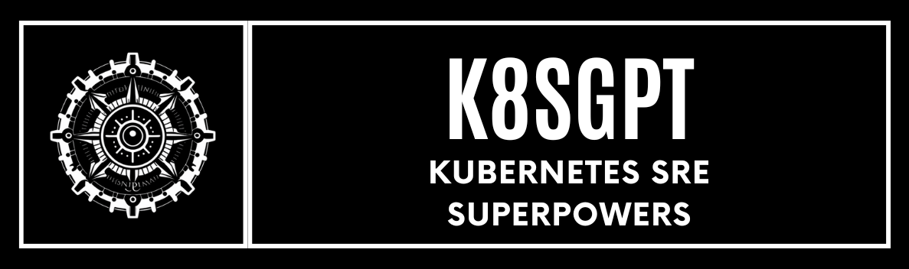

<picture>
  <source media="(prefers-color-scheme: dark)" srcset="./images/banner-white.png" width="600px;">
  
</picture>
<br/>


[](https://bestpractices.coreinfrastructure.org/projects/7272)
[](https://docs.k8sgpt.ai/)
[](https://app.fossa.com/projects/git%2Bgithub.com%2Fk8sgpt-ai%2Fk8sgpt?ref=badge_shield)
[](https://opensource.org/licenses/Apache-2.0)
[](https://github.com/k8sgpt-ai/k8sgpt)
[](https://codecov.io/github/k8sgpt-ai/k8sgpt)


# k8sgpt

**k8sgpt** is a tool designed to analyze and provide recommendations for Kubernetes issues. One of the most requested features is the ability to not only recommend solutions but also generate fixes for identified issues. This feature has now been introduced with the `--fix` flag.

## New Feature

### Problem
Previously, k8sgpt would only provide recommendations for issues, like in the example below:

```bash
kubectl get pod
NAME                 READY   STATUS                  RESTARTS         AGE
badpod               0/1     ImagePullBackOff        0                12h

```
```bash
k8sgpt analyze --explain

Output:

0: Pod default/badpod()
- Error: Back-off pulling image "nginxbad"
  Error: Kubernetes is unable to pull the image "nginxbad" due to a back-off error.

Solution: 
1. Check the image name and ensure it is spelled correctly.
2. Verify the image exists in the specified repository.
3. Ensure the image repository is accessible and the correct credentials are provided.
```

### New Functionality: `--fix` Flag
With the new `--fix` flag, k8sgpt can now generate a YAML file with fixes for certain Kubernetes issues.

#### Example Usage

```bash
./bin/k8sgpt analyze --explain --fix
```

Output:

```
Getting fix for Pod default/badpod...
Fixed yaml saved to: fixed-Pod-default-badpod.yaml
```

Inspecting the fixed YAML file:

```bash
cat fixed-Pod-default-badpod.yaml
```

Output:

```yaml
apiVersion: v1
kind: Pod
metadata:
  name: badpod
  namespace: default
spec:
  containers:
  - name: nginx
    image: nginx:latest
```

### Current Limitations
- The `--fix` functionality currently supports only **basic Pod issues**.
- It requires **OpenAI** as the backend for generating fixes.

**NOTE:** This functionality is in its alpha stage and only addresses basic Pod issues. Contributions for extending support to other resources or more advanced issues are welcome.

## Installation and Usage

### Clone the Repository

```bash
git clone https://github.com/100daysofdevops/k8sgpt.git
cd k8sgpt
git switch addingfix
make clean && make build
```

### Run the Analyzer with Fix

```bash
./bin/k8sgpt analyze --explain --fix
```

### Provide Feedback
As this feature is still in alpha, your feedback is greatly appreciated. Feel free to raise issues or contribute to the repository for enhancements.

## Contributing
If you'd like to add more functionality or fix advanced Kubernetes issues, please open a pull request or raise an issue in the repository.

